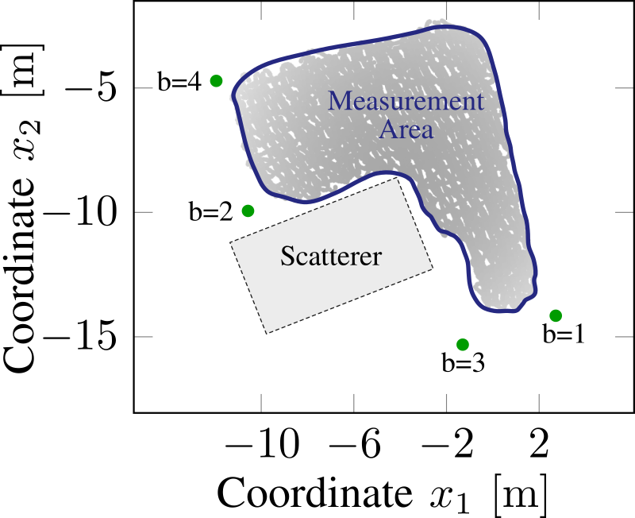
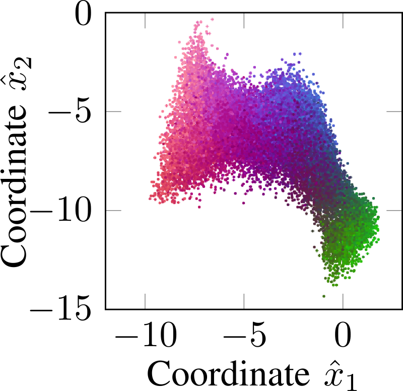
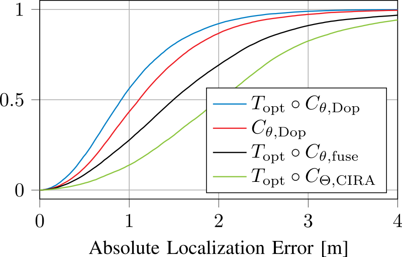
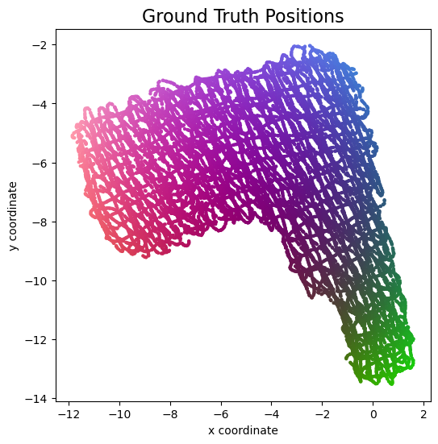
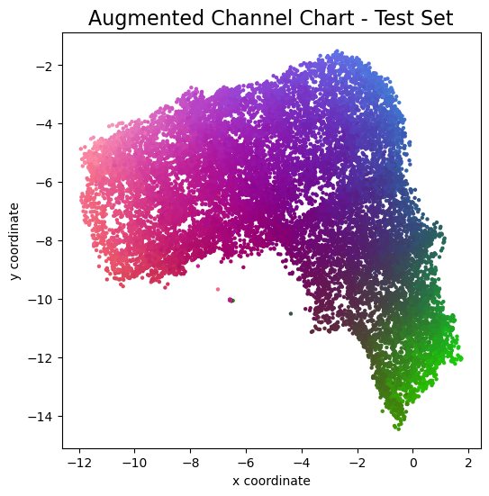

# Leveraging the Doppler Effect for Channel Charting
This repository contains partial source code for the paper

> Florian Euchner, Phillip Stephan, Stephan ten Brink: "Leveraging the Doppler Effect for Channel Charting", 25th IEEE International Workshop on Signal Processing Advances in Wireless Communications (SPAWC), 2024

* [Link to the Paper on arXiv](https://arxiv.org/abs/2404.09620)
* [Download SPAWC2024 Poster](spawc2024_poster.pdf)

### Bullet Point Summary
* [Channel State Information (CSI) fingerprinting](https://dichasus.inue.uni-stuttgart.de/tutorials/tutorial/positioning/) is a radio localization technique that identifies the position of transmitters based on CSI. Basically, we have some machine learning model (could be a neural network, or just nearest neighbor search) to predict transmitter locations given CSI after having trained it on a large collection of `(CSI, position)` examples in a supervised manner. The problem is that we need a large dataset of *labelled* training examples, which we cannot expect to have in practice.
* [Channel Charting](https://channelcharting.github.io/) can solve this. Instead of learning the CSI-to-position mapping in a supervised way, we exploit similarity relationships in CSI and use self-supervised learning. The [original paper](https://arxiv.org/abs/1807.05247) first proposing Channel Charting explains the concept neatly.
* Previous work on Channel Charting usually has the following issues:
    * We need time (and possible even phase) synchronization between all receivers to achieve good localization performance.
    * We need lots of antennas, especially if we want to [exploit angular-domain information](https://github.com/Jeija/ToA-AoA-Augmented-ChannelCharting) to learn channel charts with are accurate in the global coordinate frame (i.e., if we want to make sure that the channel chart is not arbitrarily transformed compared to the global coordinate frame).
* In our work, we show that Channel Charting is possible with very few (in our case: 4) antennas deployed in a distributed setup, and that we can get acceptable performance even if we only have frequency synchronization (and no phase / time synchronization across receiver antennas)

### Results
Training Animation | Top View Map
:-:|:-:
 | 

The animation on the left shows what the channel chart looks like over the training epochs when we train the forward charting function (FCF) on the Doppler effect-based loss.
The picture on the right shows a top view map of the environment.
There is a transmitter driving around in the L-shaped measurement area (with relatively low speed, median velocity is 0.25m/s) and we want to locate the transmitter with the four antennas b = 1, 2, 3 and 4, which are not time / phase-synchronized, only frequency-synchronized.
Classical time of arrival-based localization does not work since we do not have time synchronization.
Angle of arrival-based localization is not possible, because we do not have any angular information.
Received power (RSSI)-based localization might be possible, but will almost certainly have issues with small- and large-scale fading, non-isotropic radiation patterns and so on.
Our Doppler effect-based Channel Charting method, however, enables localization in the global coordinate frame!
While the neural network implementing the FCF needs to be trained with data from moving transmitters, once trained, the FCF will also be able to locate stationary transmitters.

Channel Chart | Empirical CDF
:-:|:-:
 | 

The picture on the left shows a channel chart trained using the Doppler effect method described in the paper.
The empirical CDFs on the right compare the localization performance of the Doppler effect-based Channel Charting technique (implemented in `1_CC_Doppler.ipynb`) to other Channel Charting techniques as baselines ("CIRA" and "fused", implemented in `1_CC_CIRA.ipynb` and `1_CC_fused.ipynb`, respectively).
See the paper for details.


### Prerequisites
Our code is based on Python, TensorFlow, NumPy, SciPy and Matplotlib.
Source files are provided as Jupyter Notebooks, which can be opened directly here on GitHub or using, e.g., [JupyterLab](https://jupyter.org/).

We run our Channel Charting experiments on a JupyterHub server with NVMe storage, AMD EPYC 7262 8-Core Processor, 64GB RAM, and a NVIDIA GeForce RTX 4080 GPU for accelerating TensorFlow.
All indications of computation times are measured on this system.
It should also be possible to run our notebooks on less performant systems.

### Notebooks - Training Procedure

First run;
* `0_DownloadDataset.ipynb`:  Run this notebook to download the relevant parts of the [`dichasus-cf0x`](https://dichasus.inue.uni-stuttgart.de/datasets/data/dichasus-cf0x/) dataset.

Then, you can run in any order:
* `1_CC_Doppler.ipynb`: Doppler effect-based Channel Charting, this is the technique with the new loss function that we propose in the paper.
* `1_CC_CIRA_Baseline.ipynb`: The baseline that we call "CIRA" in the paper. This uses the dissimilarity metric introduced in ["Indoor Localization with Robust Global Channel Charting: A Time-Distance-Based Approach"](https://arxiv.org/abs/2210.06294). It is unsurprising that the performance of the "CIRA" dissimilarity metric is not optimal here, since that metric assumes time synchronization between base station antennas.
* `1_CC_fused_Baseline.ipynb`: The baseline that we call "fused" in the paper. Here, we combine the "CIRA" metric with a timestamp-based dissimilarity metric. "Fusing" dissimilarity metrics is described [in our Channel Charting tutorial](https://dichasus.inue.uni-stuttgart.de/tutorials/tutorial/dissimilarity-metric-channelcharting/) and in [this paper](https://arxiv.org/abs/2308.09539). Note that using timestamp-based dissimilarity metrics makes some assumptions about the velocity of the transmitter (more or less constant velocity). We do not need such assumptions for Doppler effect-based Channel Charting.

The baselines get an unfair advantage: While for Doppler effect-based Channel Charting, we evaluate the FCF directly, we cannot do that for the baselines, because the coordinate frame of their channel charts is rotated / scaled / translated (affine transform) relative to the global coordinate frame.
We unfairly give favor the baselines by first finding the optimal affine transform to the global coordinate frame, and the evaluating the baselines after having transformed them.
But despite this concession, we show that we can still outperform the baselines.

### Related: Augmented Channel Charting
This paper is concerned with enabling Channel Charting for few base station antennas and under the assumption that we lack phase / time synchronization.
If you have many antennas and you can assume synchronization, then you might prefer what we call [agumented Channel Charting](https://github.com/Jeija/ToA-AoA-Augmented-ChannelCharting), where Channel Charting is combined with classical wireless source localization techniques like angle of arrival / time of arrival information.
Of course, augmented Channel Charting outperforms this Doppler effect-based technique, but only if said assumptions (high number of antennas, time / phase synchronization) are met.

Ground Truth Positions | AoA / ToA-Augmented CC
:-:|:-:
 | 

### Citation
```bibtex
@inproceedings{doppler-cc,
	author    = {Euchner, Florian and Stephan, Phillip and ten Brink, Stephan},
	title     = {{Leveraging the Doppler Effect for Channel Charting}},
	booktitle = {25th IEEE International Workshop on Signal Processing Advances in Wireless Communications (SPAWC)},
	year      = {2024}
}
```

### Other Resources
* [Christoph Studer's Channel Charting Website](https://channelcharting.github.io/)
* [The original Channel Charting paper](https://arxiv.org/abs/1807.05247)
* [The paper that introduced the CIRA metric (Eq. 13)](https://arxiv.org/abs/2210.06294)
* [DICHASUS Website](https://dichasus.inue.uni-stuttgart.de/)
* [Our tutorial on dissimilarity metric-based Channel Charting](https://dichasus.inue.uni-stuttgart.de/tutorials/tutorial/dissimilarity-metric-channelcharting/)
* [Our paper on dissimilarity metric-based Channel Charting](https://arxiv.org/abs/2308.09539)
* [Our paper on augmented Channel Charting](https://arxiv.org/abs/2312.01968)
* [Good paper on classical Doppler effect-based radio localization](https://ieeexplore.ieee.org/stamp/stamp.jsp?arnumber=6404102)
